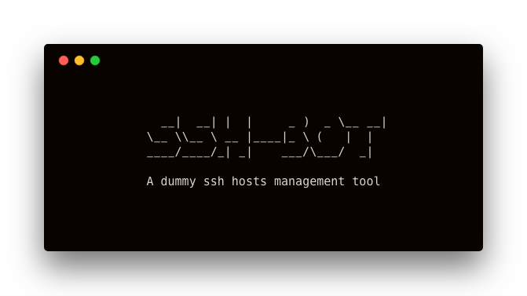
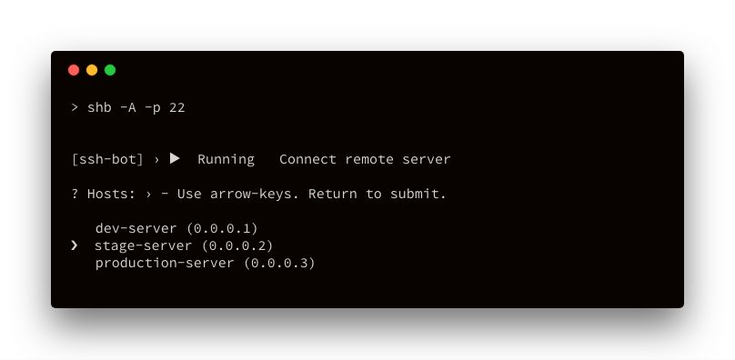

<h1 style="text-align: center;">
    ssh-bot
</h1>

<p style="text-align: center;">
    A dummy ssh hosts management tool.
</p>

<p style="text-align: center;">
    
</p>

<p style="text-align: center;">
    <a href="https://ci-server-a.airity.tw/zeckli/ssh-bot">
        
    </a>
    <a href="https://github.com/prettier/prettier">
        
    </a>
</p>

## Description
`ssh-bot` is a dummy ssh hosts management tool that makes connectinng remote hosts and managing host information a little bit easier. :)

## Install
```
npm install -g ssh-bot
```

## Usage

### Initalize
To make ssh-bot work, you have to initialize it at the first time.
```
shb init
```

### Add host
After initialization, you can add hosts that you often connect to.
```
shb add
```

### Connect
To connect a host, you only need to `shb` with ssh additional options such as `-A` and `-p`.
```
shb -A -p 22
```
<p>
    
</p>

### Edit host
You can always edit host information that you've added.
```
shb edit
```

### List hosts
See all hosts you've added.
```
shb list
```

### Remove host
Remove a host from hosts list.
```
shb remove
```

### Reset
If you want to remove all hosts, you could do a reset.
```
shb reset
```

### Help
Show help information about ssh-bot.
```
shb help
```


